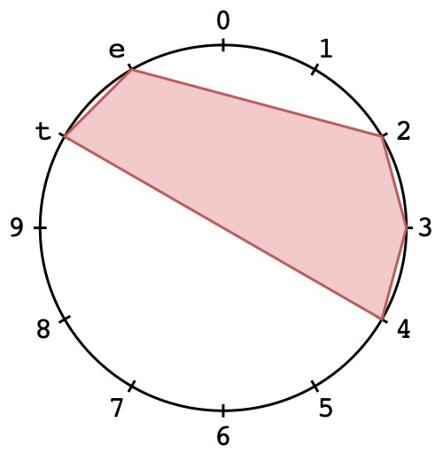
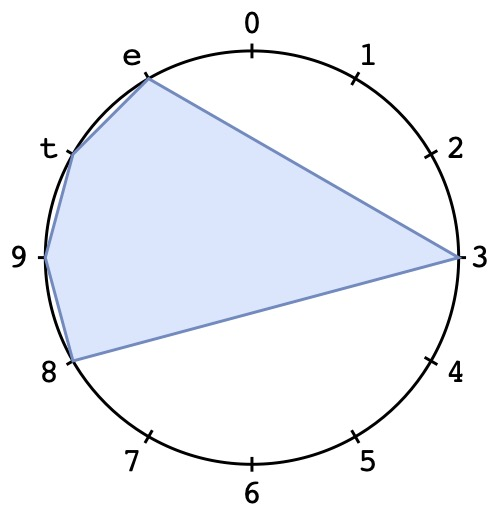

# PCS-Diagram
Easily create beautiful [pitch-class set](https://github.com/mpv-player/mpv](https://en.wikipedia.org/wiki/Set_theory_%28music%29)) [diagrams](https://en.wikipedia.org/wiki/Chromatic_circle) 

### Requirements
* python3
* fpdf2
* PyPDF2
* math

### Examples
 
