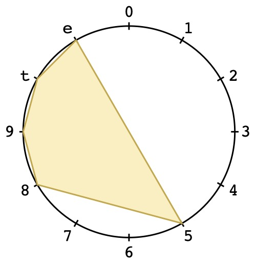

# PCS-Diagram
Easily create beautiful [pitch-class set](https://en.wikipedia.org/wiki/Set_theory_%28music%29) [diagrams](https://en.wikipedia.org/wiki/Chromatic_circle) 

### Requirements
* [python3](https://www.python.org/downloads/)
* fpdf2 package
* PyPDF2 package

To install these packages, run: 

```
pip3 install fpdf2 pyPDF2
```

### Running
```
python3 PCS-Diagram.py
```

### Examples
  
